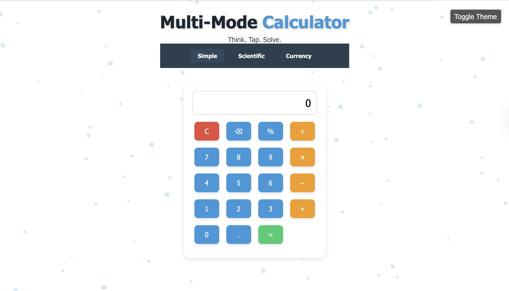
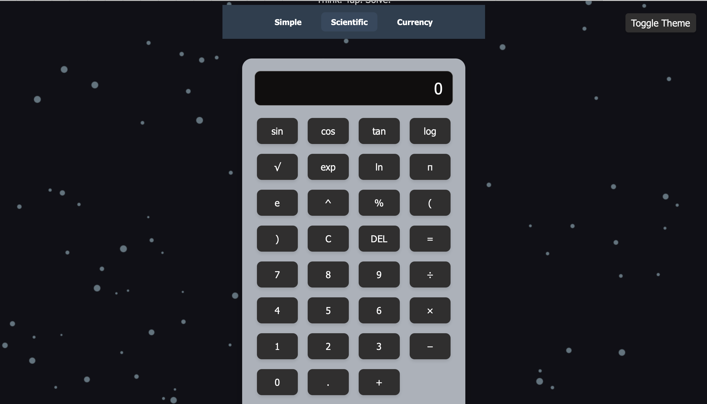
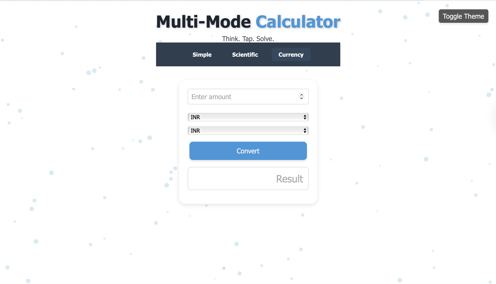

# Multi-Mode Calculator 🔢

A powerful, responsive web calculator that supports basic arithmetic, scientific operations, and real-time currency conversion — all wrapped in a modern UI with light/dark mode, floating animation, and keyboard interaction.

---

## ✨ Features

- ✅ **Simple Calculator** – Add, subtract, multiply, divide, use %, and decimals
- ✅ **Scientific Mode** – Trigonometric functions (sin, cos, tan), log, ln, π, e, exponentiation, square root, and more
- ✅ **Currency Converter** – Convert values between INR, USD, EUR, GBP (using static rates)
- ✅ **Dark Mode** – One-click theme toggle with full styling support
- ✅ **Keyboard Support** – Input values and operate via keyboard keys
- ✅ **Responsive Design** – Optimized for desktop and mobile screens
- ✅ **Animated UI** – Smooth transitions, floating bubble background
- ✅ **Calculation History** – Displays your past results clearly

---

## 📸 Live Demo / Preview

### 🔹 Simple Calculator (Light Mode)


### 🔹 Scientific Calculator (Dark Mode)


### 🔹 Currency Converter



---

## 🛠️ Built With

- **HTML5** – Semantic structure
- **CSS3** – Modern layout, animations, dark/light mode support
- **JavaScript (ES6)** – Interactive logic for all three modes
- **Canvas API** – Floating particle animation background
- **Responsive Design** – Media queries, adaptive layout

---

## 📂 Folder Structure
multi-mode-calculator/
├── index.html        # Main HTML structure
├── style.css         # CSS styling and themes
├── script.js         # JavaScript logic for all modes
├── README.md         # Project overview and instructions
├── LICENSE           # (optional) License file

## 🚀 Getting Started

To view the project locally:

1. Clone the repository:
   ```bash
   git clone https://lavanya2102-create.github.io/multi-mode-calculator/

 ## 🧠 About the Project

**Multi-Mode Calculator** is a responsive, front-end web application that integrates simple, scientific, and currency calculations in a single interface. It’s designed for both everyday users and those needing advanced math utilities.

This project was built to:
- Practice clean and modular web development
- Implement theme switching (light/dark modes)
- Handle DOM interactions and keyboard inputs
- Explore visual animations with the Canvas API
- Enhance UI/UX with transitions and responsive design

> It demonstrates how pure HTML, CSS, and JavaScript can be combined to build a practical, user-friendly tool with real-world value.


---


## 🧠 About the Project

This calculator app was designed to combine multiple day-to-day calculation needs into one interface. Whether you’re solving math problems, converting currencies, or exploring scientific functions, this tool offers an intuitive and accessible experience.

It was created to practice front-end web development skills using:
- Semantic HTML5
- Modular and themed CSS3
- Functional JavaScript (ES6+)

## 👩‍💻 Author

**Lavanya Mittal**  
Computer Science Student • Web Developer • Tech Explorer  
[LinkedIn] (www.linkedin.com/in/lavanya-mittal-b5b46b311) • [Portfolio](https://lavanya2102-create.github.io/lavanya-portfolio/)

## 📜 License

This project is licensed under the [MIT License](LICENSE).
> “Think. Tap. Solve.” – The smart way to calculate everything in one place.


